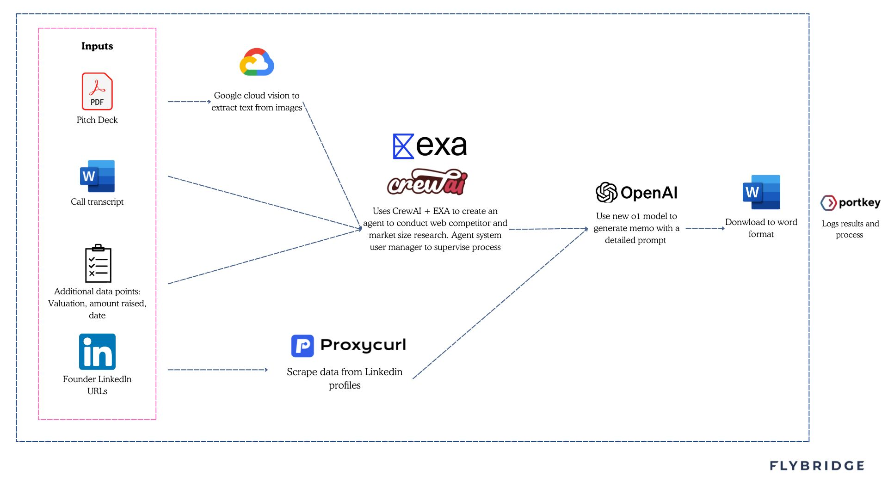

# Flybridge Investment Memorandum Generator

## Overview
The Flybridge memo generator tool helps turn decks, business plans, and call notes into a first-draft VC investment memo for AI startups. For founders, it offers insights into how VCs might evaluate your business and simplifies the process of presenting your company to investors by creating a draft memo based on the information provided. To get the most accurate results, provide as much context as possible. A helpful tip is to record your pitch and upload the transcript along with any supporting materials.

## Limitations
The memo generator produces a strong draft addressing key investor considerations but serves as a starting point, not a finished product. It covers 50-60% of the work, requiring human input for nuance and judgment. The tool may reflect biases in the input and is limited by OpenAI's o1 model. Competitor analysis provides initial insights but should be supplemented with additional research, and market size estimates should include a separate bottoms-up analysis. This tool is for informational purposes only.

## Features

### Smart Document Processing
- Support for multiple document formats (PDF, Word, scanned documents)
- Built-in OCR capability for processing scanned materials
- Web content integration through URL processing
### Agentic research analysis
- Automated market research and competitor analysis
- Market size and growth rate calculations
### Team Analysis
- LinkedIn profile integration for founder background analysis
### Memorandum Generation
- Auto-generated comprehensive investment memorandums
### Feedback and Observability
- Integration with Portkey's feedback API for quality monitoring

# Getting Started

## Prerequisites

- Node.js (v16.x or higher)
- Python (v3.8 or higher)
- npm (Node Package Manager)
- pip (Python Package Manager)
- Google Cloud SDK (for managing Google Cloud resources)

You'll need to set up the following API keys in your environment variables:
OpenAI API Key
Portkey API Key
EXA AI API Key
Proxycurl API Key
Google Cloud Vision API credentials JSON file

## Installation
1. Clone the Repository
```bash
git clone https://github.com/danielp1234/memo-generator.git
cd memo-generator
```

2. Install Node.js Dependencies
```bash
npm install
```

3. Install Python Dependencies
```bash
pip install -r requirements.txt
pip install 'crewai[tools]'
```

4. Build the Project
```bash
npm run build
```

## Set Up Environment Variables
Rename the `.env.example` file to simply `.env` and fill in the below environment variables (see below for instructions):
```env
OPENAI_API_KEY=your-openai-api-key
EXA_API_KEY==your-exa-api-key
PROXYCURL_API_KEY=your-proxycurl-api-key
GOOGLE_APPLICATION_CREDENTIALS=./path-to-your-google-cloud-credentials.json
PORTKEY_API_KEY=your-portkey-api-key
PORT=3002
GOOGLE_CLOUD_PROJECT_ID=flybridgememo-generator
```

### Set Up Google Cloud Vision API
- Create a Google Cloud Project: Ensure you have a Google Cloud project. If you don't have one, create it in the Google Cloud Console.
- Enable the Cloud Vision API
  - Navigate to APIs & Services > Library in the Google Cloud Console.
  - Search for Cloud Vision API and enable it.
- Create a Cloud Storage Bucket
  - Navigate to Cloud Storage > Click Create Bucket and Name the bucket (e.g., memo-generator) -Click Create.
- Set Up Service Account Permissions
  - Navigate to IAM & Admin > IAM.
  - Locate your service account (e.g., your-service-account@your-project-id.iam.gserviceaccount.com).
  - Click the Edit (pencil) icon next to the service account.
  - Click Add Another Role and assign the following roles:
    - Storage Object Admin (roles/storage.objectAdmin)
    - Storage Object Creator (roles/storage.objectCreator)
    - Storage Object Viewer (roles/storage.objectViewer)
    - Cloud Vision AI Service Agent (roles/visionai.serviceAgent)
- Obtain your Google Cloud Vision API credentials JSON file. Ensure you enable 
Cloud Vision API
- Place the JSON file in the root directory of the project under file name: cloud-credentials.json


## Usage
### Development
To start the development server, which runs both the backend and frontend concurrently:
```bash
npm run dev
```

### Production
To build and start the production server:
```bash
npm run build
npm start
```

## Project Structure
- index.js: The main Node.js server file.
- src/: Contains the React frontend code.
- components/: React components used in the frontend.
- main.py: Python script for market analysis.
- agents.py: Python script defining agents for market research.
- tasks.py: Additional Python script for tasks.
- public/: Contains static assets and the index.html file.
- .env: Environment variables configuration file.
- package.json: Node.js dependencies and scripts.
- requirements.txt: Python dependencies.

## System Diagram
- Bellow is diagram that explain the components of the application

- See example output memo [Link](https://docsend.com/view/ke4jyy5yr3y3wmsf)


## License
Released under the MIT License. See the LICENSE file for more details.